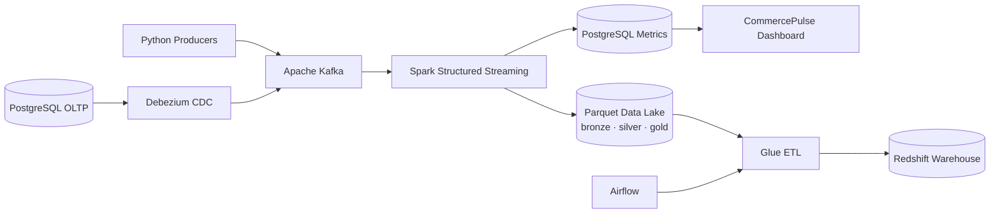

# E-Commerce Analytics Platform

[](docker-compose.yml)
[](kafka/)
[](spark/)
[](producers/)

Production-style **real-time data engineering platform** which simulates an e-commerce analytics stack end to end — **runs fully on Docker** without AWS deployment.

## Architecture



| Path | Flow |
|------|------|
| **Streaming** | Producers → Kafka → Spark → PostgreSQL + Bronze Parquet → Dashboard |
| **CDC** | Postgres OLTP → Debezium → Kafka → Silver layer |
| **Batch** | Bronze → Glue (PySpark local) → Gold → Redshift (PG warehouse sim) |

Full diagrams (Mermaid, ASCII, README): **[docs/ARCHITECTURE_DIAGRAM.md](docs/ARCHITECTURE_DIAGRAM.md)** · [architecture.md](docs/architecture.md) · [interview_guide.md](docs/interview_guide.md)

## Tech Stack

| Layer | Technology | Local Status |
|-------|------------|--------------|
| Streaming bus | Apache Kafka | ✅ Runs in Docker |
| Stream processing | Spark Structured Streaming 3.5 | ✅ Auto-starts |
| CDC | Debezium + Kafka Connect | ⚡ Optional profile |
| Data lake | Parquet (local `data/lake/`) | ✅ Simulates S3 |
| Metrics / warehouse | PostgreSQL | ✅ Simulates Redshift |
| Batch ETL | PySpark + Airflow | ✅ Reference + local DAG |
| Cloud ETL | AWS Glue scripts | 📄 Reference only |
| Dashboard | CommercePulse (Streamlit + Plotly) | ✅ Port 8501 |
| Orchestration | Apache Airflow | ⚡ Optional profile |

## Quick Start

### Prerequisites

- [Docker Desktop](https://www.docker.com/products/docker-desktop/) (8 GB RAM recommended)
- Python 3.11+ (optional, for `seed_metrics.py`)

### Run the core pipeline

```bash
git clone <your-repo>
cd ecommerce-realtime-platform   # or Ecommerce Project

cp .env.example .env
./scripts/setup.sh          # or: make setup
```

Wait **1–2 minutes**, then open:

| Service | URL |
|---------|-----|
| **Dashboard** | http://localhost:8501 |
| **Spark UI** | http://localhost:8080 |
| **Kafka** | `localhost:9092` |

```bash
./scripts/healthcheck.sh    # verify all services
python3 scripts/seed_metrics.py   # instant demo data (optional)
```

### Optional components

```bash
make cdc       # Debezium CDC pipeline
make airflow   # Airflow UI http://localhost:8088 (admin/admin)
make batch     # Bronze → gold batch ETL + warehouse load
```

## What Runs Locally vs Simulated

| Component | Local behavior |
|-----------|----------------|
| Kafka, producers | Fully functional |
| Spark unified streaming | Fully functional — auto-starts |
| Dashboard | Fully functional |
| Data lake (S3) | **Local Parquet** in `./data/lake/` |
| Redshift | **PostgreSQL `warehouse` schema** |
| AWS Glue | **PySpark batch** (`spark/batch/silver_to_gold.py`) |
| Airflow AWS operators | Reference DAGs; use `local_batch_etl_dag.py` locally |

Details: [docs/LOCAL_VS_CLOUD.md](docs/LOCAL_VS_CLOUD.md)

## Project Structure

```
├── producers/           # Kafka event simulators
├── kafka/               # Topic config & init scripts
├── spark/streaming/     # unified_streaming.py (main job)
├── spark/batch/         # Local Glue-equivalent ETL
├── cdc/                 # Debezium connector (optional)
├── dashboard/           # Streamlit real-time UI
├── airflow/dags/        # Orchestration
├── glue_jobs/           # AWS reference ETL
├── redshift/            # Warehouse reference SQL
├── infra/postgres/      # DB init (metrics + warehouse + CDC)
├── data/lake/           # Bronze/silver/gold parquet output
├── configs/             # Central settings
├── scripts/             # setup, healthcheck, seed, batch
└── docs/                # Architecture, interview prep
```

## Key Metrics (Portfolio)

| Metric | Value |
|--------|-------|
| Simulated throughput | **~15 events/sec** (~1.3M/day) |
| Kafka topics | **5** (+ optional CDC topics) |
| Stream processing latency | **~30–60 sec** (configurable trigger) |
| Late-data handling | **10-min watermark** |
| Dashboard refresh | **5 sec** |
| Data lake format | **Partitioned Parquet** |

## Screenshots


## Documentation

- [Setup guide](docs/setup.md)
- [Architecture deep-dive](docs/architecture.md)
- [Interview guide](docs/interview_guide.md)
- [Interview Q&A](docs/interview_qa.md)
- [Portfolio / demo script](docs/PORTFOLIO.md)

## Interview Demo (5 minutes)

1. `docker compose ps` — show running services  
2. Open dashboard — live KPIs updating  
3. Spark UI — streaming job active  
4. `ls data/lake/bronze/orders` — parquet bronze layer  
5. `psql` → `SELECT * FROM realtime.dashboard_snapshot`  
6. Walk through `docs/architecture.md` Mermaid diagram  

## License

MIT
