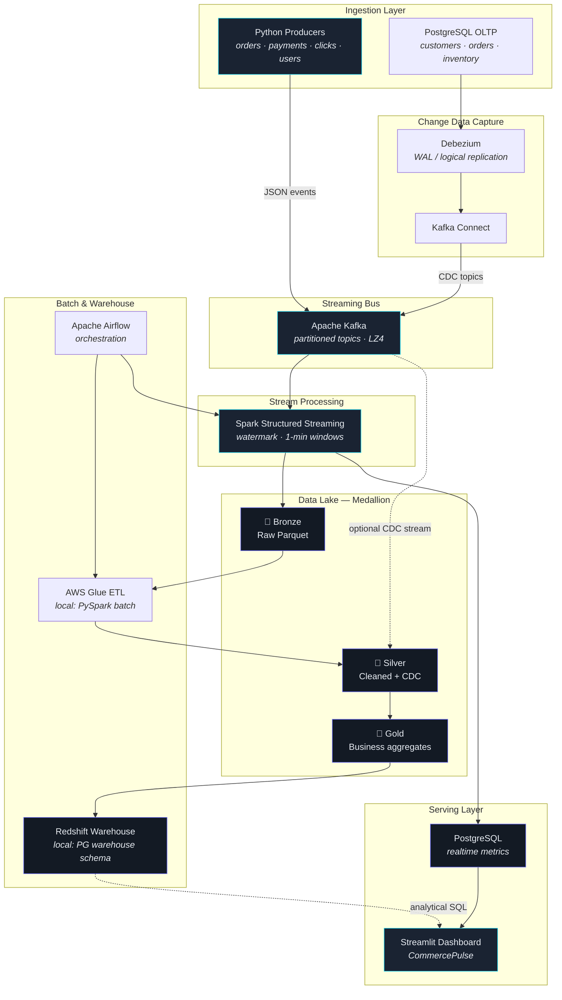
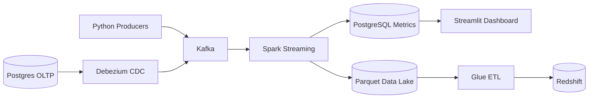

# Architecture Diagrams — E-Commerce Real-Time Data Platform

Use these in README, presentations, and interviews. Three formats: Mermaid (GitHub), ASCII (terminals/docs), and README embed.

---

## 1. Mermaid Diagram (Primary)



### Simplified Mermaid (README hero)



---

## 2. Clean Markdown / ASCII Diagram

```
┌─────────────────────────────────────────────────────────────────────────────────┐
│                     E-COMMERCE REAL-TIME DATA PLATFORM                          │
└─────────────────────────────────────────────────────────────────────────────────┘

  INGESTION                    STREAMING                 PROCESSING
  ─────────                    ─────────                 ──────────

  ┌──────────────┐             ┌─────────────┐           ┌──────────────────────┐
  │   Python     │  events     │   Apache    │  consume  │  Spark Structured    │
  │  Producers   │────────────►│    Kafka    │──────────►│     Streaming        │
  │ ~15 evt/sec  │             │  5 topics   │           │  unified_streaming   │
  └──────────────┘             └──────▲──────┘           └──────────┬───────────┘
                                      │                              │
  ┌──────────────┐             ┌──────┴──────┐                       │
  │  PostgreSQL  │  WAL        │  Debezium   │                       │
  │    OLTP      │────────────►│  + Connect  │───────────────────────┘
  │ (CDC source) │             │    (CDC)    │
  └──────────────┘             └─────────────┘

                                         │
                    ┌────────────────────┼────────────────────┐
                    ▼                    ▼                    ▼
             ┌─────────────┐      ┌─────────────┐      ┌─────────────┐
             │   BRONZE    │      │  PostgreSQL │      │   SILVER    │
             │   Parquet   │      │   realtime  │      │  (CDC ref)  │
             │  data/lake  │      │   schema    │      │   Parquet   │
             └──────┬──────┘      └──────┬──────┘      └──────┬──────┘
                    │                    │                    │
                    │             ┌──────▼──────┐             │
                    │             │ Streamlit   │             │
                    │             │ Dashboard   │             │
                    │             │ CommercePulse│            │
                    │             └─────────────┘             │
                    │                                         │
                    └──────────────┬──────────────────────────┘
                                   ▼
                            ┌─────────────┐
                            │    GOLD     │◄── Glue ETL (PySpark local)
                            │  aggregates │
                            └──────┬──────┘
                                   ▼
                            ┌─────────────┐
                            │  Redshift   │◄── Airflow orchestration
                            │  warehouse  │    (PG warehouse sim locally)
                            └─────────────┘
```

---

## 3. README-Ready Version

Copy into `README.md`:

### System Architecture

```
Producers → Kafka → Spark Structured Streaming → PostgreSQL + Parquet Lake → Dashboard
                ↑
         Postgres → Debezium CDC
```

| Stage | Technology | Output |
|-------|------------|--------|
| Ingest | Python, Kafka | 5 partitioned topics |
| Stream process | Spark Structured Streaming | 1-min windows, 10-min watermark |
| Real-time serve | PostgreSQL `realtime` | KPI tables + snapshot |
| Data lake | Parquet bronze/silver/gold | `data/lake/` |
| CDC | Debezium → Kafka | OLTP change events |
| Batch | Glue-style PySpark + Airflow | Gold tables → warehouse |
| Analytics | Redshift (sim: PostgreSQL) | Star schema |
| UI | Streamlit CommercePulse | Executive dashboard |

Full diagram: [docs/ARCHITECTURE_DIAGRAM.md](docs/ARCHITECTURE_DIAGRAM.md)

---

## Data Flow Summary

| Path | Latency | Purpose |
|------|---------|---------|
| **Hot** | ~30–60s | Operational KPIs on dashboard |
| **Warm** | Minutes | Bronze parquet for replay |
| **Cold** | Daily | Gold + warehouse for BI |

---

## Layer Reference

| Layer | Format | Written by |
|-------|--------|------------|
| Bronze | Parquet | Spark Streaming |
| Silver | Parquet | CDC / cleansing jobs |
| Gold | Parquet | Glue ETL / Spark batch |
| Warehouse | Columnar SQL | Redshift COPY (local: PG) |
