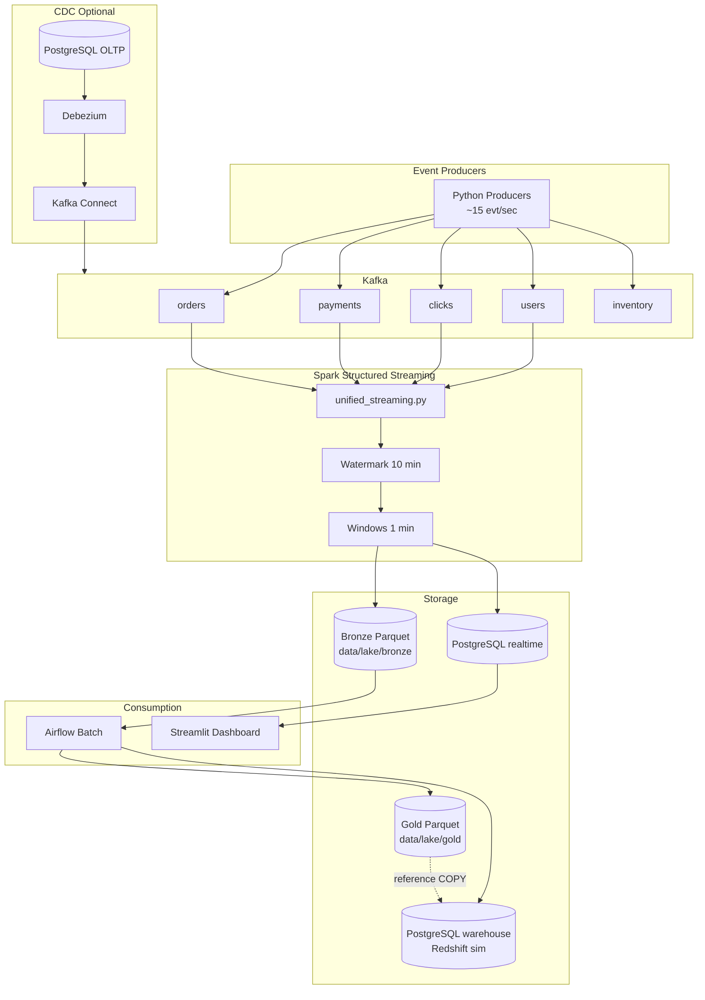

# System Architecture

## Overview

An event-driven analytics platform modeling how mid-size e-commerce companies ingest behavioral data, process it in real time, store it in a lakehouse, and serve KPIs to operators and analysts.

**Design goal:** Production-shaped architecture, **local-first** execution (Docker only).

> **Canonical diagrams:** See [ARCHITECTURE_DIAGRAM.md](ARCHITECTURE_DIAGRAM.md) for Mermaid (full + simplified), ASCII, and README-ready versions.

## End-to-End Diagram



## Streaming Path (Core)

| Step | Component | Detail |
|------|-----------|--------|
| 1 | Producers | JSON events, keyed by `order_id` / `session_id` / etc. |
| 2 | Kafka | 5 topics, LZ4 compression, explicit partitions |
| 3 | Spark | `unified_streaming.py` — 10 queries, shared checkpoint root |
| 4 | Bronze | Append Parquet partitioned by `year/month/day` |
| 5 | Metrics | JDBC append to `realtime.*` tables |
| 6 | Snapshot | psycopg2 updates `dashboard_snapshot` row |
| 7 | Dashboard | Streamlit polls PostgreSQL every 5s |

**Latency:** ~30–60 seconds (Spark trigger interval + window close).

## CDC Path (Optional `--profile cdc`)

```
PostgreSQL (ecommerce_cdc.*) 
  → logical replication (pgoutput) 
  → Debezium 
  → Kafka topics 
  → Spark CDC job (reference: cdc_stream.py)
  → silver parquet
```

Demonstrates **WAL-based CDC** without modifying application code.

## Batch Path

```
bronze parquet 
  → spark/batch/silver_to_gold.py (local Glue sim) 
  → gold parquet 
  → SQL into warehouse.daily_revenue_summary
```

Triggered manually (`make batch`) or via Airflow `local_batch_etl_dag`.

## Medallion Layers

| Layer | Path | Content |
|-------|------|---------|
| Bronze | `data/lake/bronze/{orders,payments,clicks,users}/` | Raw Kafka JSON parsed to columns |
| Silver | `data/lake/silver/cdc/` | CDC events (when enabled) |
| Gold | `data/lake/gold/daily_revenue/` | Daily aggregates by country/category |

## PostgreSQL Schemas

| Schema | Role |
|--------|------|
| `ecommerce_cdc` | OLTP + CDC source tables |
| `realtime` | Streaming metrics + dashboard snapshot |
| `warehouse` | Dimensional model (Redshift simulation) |
| `batch` | Daily rollups |

## Kafka Topic Design

See `kafka/config/topic_config.json`. Partition count scales with expected QPS — clicks highest at 12 partitions.

## Fault Tolerance

- **Kafka:** offset commits via Spark checkpoint  
- **Spark:** `checkpointLocation` per query under `/opt/spark/checkpoints`  
- **Producer:** retry on buffer full, delivery callback logging  
- **Docker:** `restart: unless-stopped` on producer, dashboard, spark-streaming  

## Security (Production Notes)

Not enabled locally; production would add Kafka SASL/SSL, IAM roles for S3, Secrets Manager for JDBC passwords, and VPC isolation.
